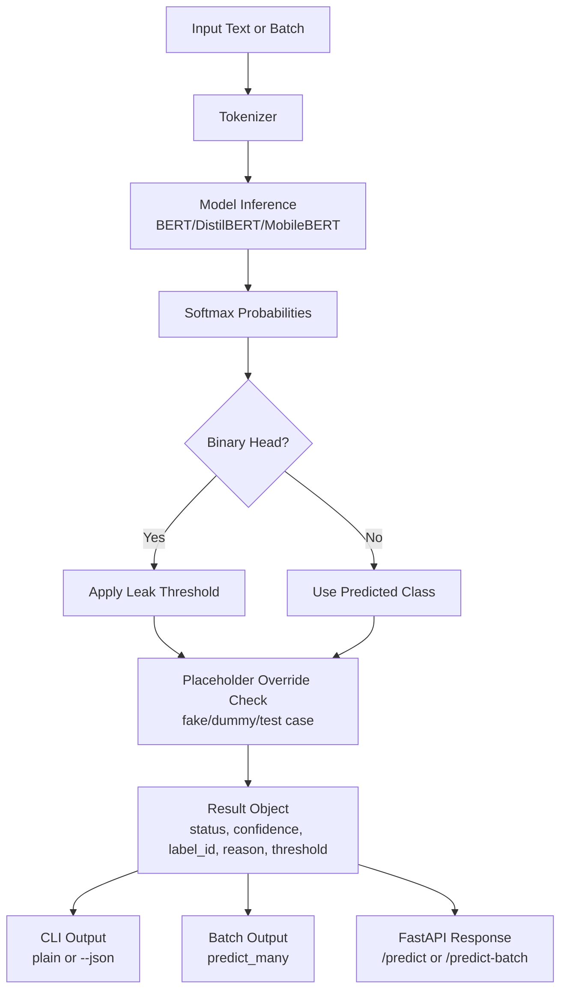

# DataGuard Architecture

## Overview
DataGuard uses a sequence-classification model pipeline with post-processing controls for practical DLP behavior.

## End-to-End Working Flow

## Components
- `src/model_loader.py`: validates tier/version and loads tokenizer/model from `models/`.
- `src/inference.py`: single/batch inference, thresholding, placeholder override, JSON CLI mode.
- `src/setup_models.py`: full or tier-specific weight download from Hugging Face.
- `src/benchmark.py`: benchmark with warmup/iterations and threshold passthrough.
- `src/api.py`: production-friendly REST endpoints.
- `tests/test_inference_post_processing.py`: behavior tests for threshold and override logic.
